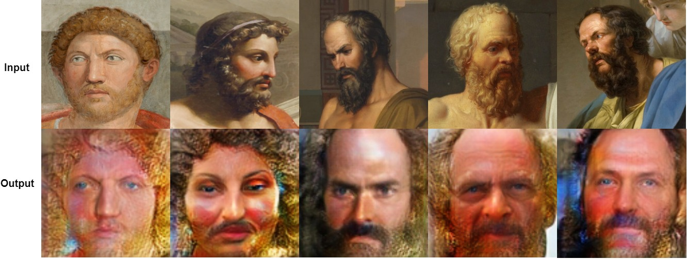
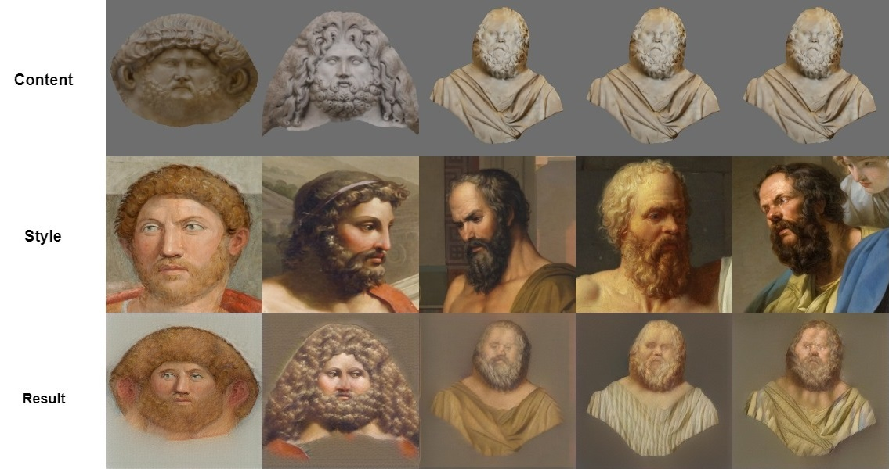
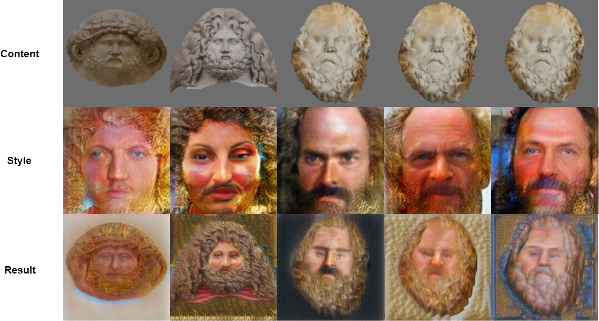

# HeritageNST
## Neural Style Transfer for the colourisation of cultural heritage statues

This project was completed for the fulfilment of an MSc in Computer Science.
The project presents a pipeline for the colourisation of statues in a cultural heritage context through the use of contemporary deep learning networks.
The networks used in this pipeline are:
GLStyleNet: Higher Quality Style Transfer Combining Global and Local Pyramid Features -  https://github.com/EndyWon/GLStyleNet
Disentangled Representation Learning GAN for Pose-Invariant Face Recognition (DR-GAN) - http://cvlab.cse.msu.edu/project-dr-gan.html

The colourisation of three historical marble statues are shown in this project. These are a statue of Socrates in Trinity College Dublin, and statues of the Greek god Zeus and the Roman emperor Hadrian, both from the British Museum.

Textured virtual models for each statues are generated using photogrammetry.
Neural style transfer is then used between this texture and a representation of that historical figure in painting.
Semantic local style transfer through GLStyleNet is used to achieve satisfactory colourisations of the marble statues.

The DR-GAN network of Tran et al. is used to demonstrate the potential for pose synthesis networks to be used as a pre-processing step to promote more accurate colour mappings during style transfer. 

### Style Images for colourisation
The style images used for colourisation are shown below. The first two images depict Hadrian and Zeus respectively. The remaining images each represent Socrates. The second row shows the output of the DR-GAN network for frontal face pose synthesis when the painted images are used as input.

### Colourisation based on historical paintings
The results of style transfer between the statue textures and the painting reference images are shown next.

### Colourisation based on synthesised frontal pose images
Next are the results of style transfer between the model textures and frontalised images.

### Video demo
The colourised textures visualised over the 3D model can be seen in the following video: https://youtu.be/xxQsdYkYVEg
A second demo showing a rough mockup of the app used in AR: https://youtu.be/DibLfgwFdRc
